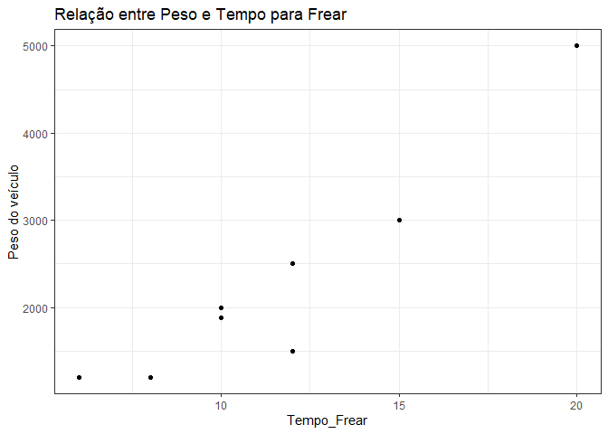

<!-- README.md is generated from README.Rmd. Please edit that file -->

### Regressão Linear (Estudo PY e R)

<!-- badges: start -->
<!-- badges: end -->

``` r
library(tidyverse)
library(reticulate)
library(tidymodels)
```

``` python
import pandas as pd
import numpy as np
from sklearn.linear_model import LinearRegression
import statsmodels.api as sm
```

#### **O objetivo desse estudo é abordar:**

##### - Os conceitos de Regressão Linear **Simples e Múltipla**;

##### - Formas de **interpretar** os resultados obtidos;

##### **- Previsões**;

##### - **Pressuspostos** dos modelos;

##### - Aplicação prática em **R e Python**.

##### A técnica da regressão linear possibilita o estudo da relação entre uma ou mais variáveis explicativas que se mostram de forma **linear** e uma variável dependente.

#### O modelo de regressão linear simples é expresso pela **equação**:

*Y* = *β*<sub>0</sub> + *β*<sub>1</sub>*x* + *ϵ*

##### Onde,

##### Y = variável dependente;

##### x = variável explicativa;

*β*<sub>0</sub> é o intercepto;

*β*<sub>1</sub> é o coeficiente angular da variável explicativa x;

*ϵ* é o termo de erro.

### Exemplo inicial(ilustrativo):

##### Analisar se existe relação entre o tempo que um veículo leva para frear

##### Tempo para frear o carro x peso do veículo

``` r
df_r <- data.frame('carro' = c('A','B','C','D','F','G','H','I'),
                 'peso' = c(1200,1880,2500,2000,3000,5000,1500,1200),
                 'tempo_frear' = c(6,10,12,10,15,20,12,8))
df_r
#>   carro peso tempo_frear
#> 1     A 1200           6
#> 2     B 1880          10
#> 3     C 2500          12
#> 4     D 2000          10
#> 5     F 3000          15
#> 6     G 5000          20
#> 7     H 1500          12
#> 8     I 1200           8
```

``` python
df_py = pd.DataFrame({'carro': ['A','B','C','D','F','G','H','I'],
                   'peso':[1200,1880,2500,2000,3000,5000,1500,1200],
                   'tempo_frear': [6,10,12,10,15,20,12,8]})
df_py
#>   carro  peso  tempo_frear
#> 0     A  1200            6
#> 1     B  1880           10
#> 2     C  2500           12
#> 3     D  2000           10
#> 4     F  3000           15
#> 5     G  5000           20
#> 6     H  1500           12
#> 7     I  1200            8
```

### Será apresentado de forma alternada mostrar os resultados em Python e R para nao ficar tão repetitivo.

``` r
df_r %>% 
  ggplot()+
  aes(tempo_frear, peso)+
  geom_point()+
  ylab('Peso do veículo')+
  xlab('Tempo_Frear')+
  ggtitle('Relação entre Peso e Tempo para Frear')+
  theme_bw()
```

<!-- -->

#### Com a técnica de regressão buscamos a reta que melhor se ajuste a nuvem de pontos, considerando o intercepto e coeficiente angular resultem no menor somatório dos quadrados dos resíduos. (Método de Mínimos Quadrados Ordinários MQO)

$$
\\sum\\limits\_{i=1}^{\\mbox{n}} (Y - \\beta\_0 + \\beta\_1 x + \\epsilon)^2 = mín
$$

##### Ajustando o modelo em R

``` r
modelo_r <- lm(tempo_frear ~ peso, data = df_r)
modelo_r
#> 
#> Call:
#> lm(formula = tempo_frear ~ peso, data = df_r)
#> 
#> Coefficients:
#> (Intercept)         peso  
#>    4.224369     0.003239
summary(modelo_r)
#> 
#> Call:
#> lm(formula = tempo_frear ~ peso, data = df_r)
#> 
#> Residuals:
#>     Min      1Q  Median      3Q     Max 
#> -2.1109 -0.4892 -0.3173  0.1816  2.9175 
#> 
#> Coefficients:
#>              Estimate Std. Error t value Pr(>|t|)    
#> (Intercept) 4.2243688  1.2169103   3.471 0.013281 *  
#> peso        0.0032388  0.0004732   6.845 0.000478 ***
#> ---
#> Signif. codes:  0 '***' 0.001 '**' 0.01 '*' 0.05 '.' 0.1 ' ' 1
#> 
#> Residual standard error: 1.58 on 6 degrees of freedom
#> Multiple R-squared:  0.8865, Adjusted R-squared:  0.8676 
#> F-statistic: 46.85 on 1 and 6 DF,  p-value: 0.0004781
```

##### Ajustando o modelo em Python

``` python
x = df_py[['peso']]
y = df_py[['tempo_frear']]
modelo_py = LinearRegression()
```

``` python
# é necessário adicionar uma constante a matriz X
x_sm = sm.add_constant(x)
results = sm.OLS(y, x_sm).fit()
results.summary()
```

<table class="simpletable">
<caption>OLS Regression Results</caption>
<tr>
  <th>Dep. Variable:</th>       <td>tempo_frear</td>   <th>  R-squared:         </th> <td>   0.886</td>
</tr>
<tr>
  <th>Model:</th>                   <td>OLS</td>       <th>  Adj. R-squared:    </th> <td>   0.868</td>
</tr>
<tr>
  <th>Method:</th>             <td>Least Squares</td>  <th>  F-statistic:       </th> <td>   46.85</td>
</tr>
<tr>
  <th>Date:</th>             <td>Thu, 23 Sep 2021</td> <th>  Prob (F-statistic):</th> <td>0.000478</td>
</tr>
<tr>
  <th>Time:</th>                 <td>22:34:43</td>     <th>  Log-Likelihood:    </th> <td> -13.858</td>
</tr>
<tr>
  <th>No. Observations:</th>      <td>     8</td>      <th>  AIC:               </th> <td>   31.72</td>
</tr>
<tr>
  <th>Df Residuals:</th>          <td>     6</td>      <th>  BIC:               </th> <td>   31.88</td>
</tr>
<tr>
  <th>Df Model:</th>              <td>     1</td>      <th>                     </th>     <td> </td>   
</tr>
<tr>
  <th>Covariance Type:</th>      <td>nonrobust</td>    <th>                     </th>     <td> </td>   
</tr>
</table>
<table class="simpletable">
<tr>
    <td></td>       <th>coef</th>     <th>std err</th>      <th>t</th>      <th>P>|t|</th>  <th>[0.025</th>    <th>0.975]</th>  
</tr>
<tr>
  <th>const</th> <td>    4.2244</td> <td>    1.217</td> <td>    3.471</td> <td> 0.013</td> <td>    1.247</td> <td>    7.202</td>
</tr>
<tr>
  <th>peso</th>  <td>    0.0032</td> <td>    0.000</td> <td>    6.845</td> <td> 0.000</td> <td>    0.002</td> <td>    0.004</td>
</tr>
</table>
<table class="simpletable">
<tr>
  <th>Omnibus:</th>       <td> 3.638</td> <th>  Durbin-Watson:     </th> <td>   1.934</td>
</tr>
<tr>
  <th>Prob(Omnibus):</th> <td> 0.162</td> <th>  Jarque-Bera (JB):  </th> <td>   0.868</td>
</tr>
<tr>
  <th>Skew:</th>          <td> 0.788</td> <th>  Prob(JB):          </th> <td>   0.648</td>
</tr>
<tr>
  <th>Kurtosis:</th>      <td> 3.350</td> <th>  Cond. No.          </th> <td>5.60e+03</td>
</tr>
</table><br/><br/>Notes:<br/>[1] Standard Errors assume that the covariance matrix of the errors is correctly specified.<br/>[2] The condition number is large, 5.6e+03. This might indicate that there are<br/>strong multicollinearity or other numerical problems.

\#\#\#\#Dataframe com as predições e coluna de erro

``` r
df_r_com_previsao <- df_r %>% 
                    mutate(tempo_pred = predict(modelo_r),
                           erro_abs = abs(tempo_frear-tempo_pred))
df_r_com_previsao
#>   carro peso tempo_frear tempo_pred  erro_abs
#> 1     A 1200           6   8.110915 2.1109147
#> 2     B 1880          10  10.313291 0.3132907
#> 3     C 2500          12  12.321339 0.3213395
#> 4     D 2000          10  10.701945 0.7019453
#> 5     F 3000          15  13.940734 1.0592664
#> 6     G 5000          20  20.418310 0.4183102
#> 7     H 1500          12   9.082551 2.9174488
#> 8     I 1200           8   8.110915 0.1109147
```
